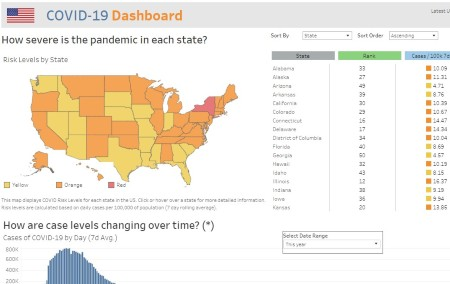

# Project: Analyzing Coronavirus Data in the U.S.
- **Software:** Github, Microsoft SQL Server, Google Sheets / Drive, Tableau
- **Data:** New York Times COVID-19 Data

**Overview:** Download data from the NYT Github. Create a stored procedure in MS SSMS (Microsoft SQL Server Management Studio) to bulk import the csv, add some newly aggregated columns, update the database table, and perform a query to export the cleaned data to a csv file.
Establish a data connection with Tableau and perform an analysis of the data. Create visualizations and a dashboard. To view  the completed dashboard, CTRL + click here: 

### [Tableau dashboard](https://public.tableau.com/app/profile/john.gimlin/viz/USCovidDashboard_16650068733810/Dashboard)

